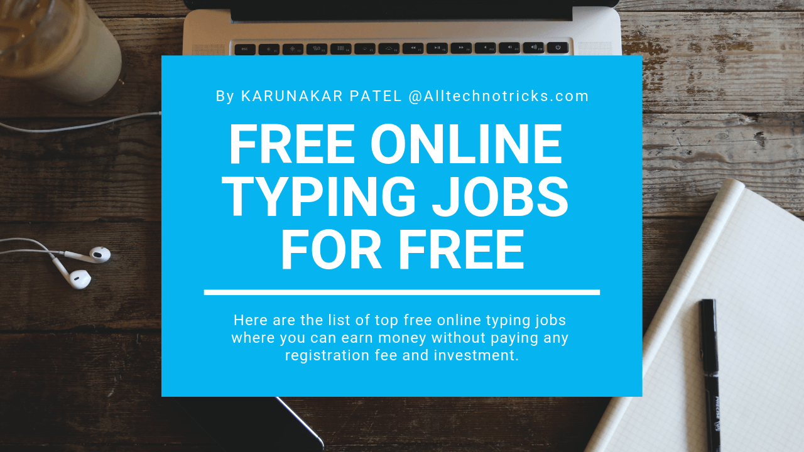

	

					<ol>
						<li style="font-weight: bold; list-style: none;">{{page.title}}</li>
						<li style="list-style-position: inside;"><a href="#free-online-typing-jobs"><h2><strong>Free Online Typing Jobs.</strong></h2></a></li>
						<li style="list-style-position: inside;"><a href="#freelancer-money"><h2><strong>Earn Money By Freelancing.</strong></h2></a></li>
						<li style="list-style-position: inside;"><a href="#online-paid-surveys"><h2><strong>Earn Money By Online Paid Surveys.</strong></h2></a></li>
						<li style="list-style-position: inside;"><a href="#blogging-money"><h2><strong>Make Money By Blogging.</strong></h2></a></li>
						<li style="list-style-position: inside;"><a href="#money-ptc-sites"><h2><strong>Earn Money Online By PTC Sites.</strong></h2></a></li>
						<li style="list-style-position: inside;"><a href="#affiliate-marketing"><h2><strong>Earn Money By Affiliate Marketing.</strong></h2></a></li>
						<li style="list-style-position: inside;"><a href="#event-blogging"><h2><strong>Make Money From Event Blogging.</strong></h2></a></li>
						<li style="list-style-position: inside;"><a href="#web-developer"><h2><strong>Earn Money As WebDeveloper.</strong></h2></a></li>
					</ol>
				

		

Is there any way to earn money online?. Yes, indeed we can earn money online with zero investment. I just included various type of online money making jobs to receive payment on a weekly basis without paying any registration fees.

Here we will find all the best methods to earn money online without paying any registration fees. Yes, indeed it is 100% free to signup. As there are different types of legitimate money making process, it is up to one's individual to choose any of the one ways to make money online.

I personally got paid through these sites and iam still earning through some of these sites. Normally, I do the online typing job as it was very easy for that whose typing speed is good.

Eventually, I had gone through this money making sites and I was updating all of my content according to the updated sites. These are the top legitimate ways to earn money online. Importantly, we can start earning money with zero investment.

Honestly, I placed only the ways through which I got paid through these legitimate online earning sites. There is no previous experience needed, all you need to spend the time to read this complete post.

<h3><strong>How can I earn money online?</strong></h3>

All the jobs offered through these sites include online/offline typing jobs, data entry jobs, money through blogging, event blogging, money from freelancing, PTC money making sites, affiliate marketing, web developer etc.

All these online money making sites had passed through these following guidelines.

<ol>
					<li>All the ways which we were making money are 100 % Legitimate...!</li>
					<li>There is no registration fee required to join in this various kinds of online job portals...! </li>
					<li>Yes, Indeed. It's free to signup.</li>
					<li>All the payment process with the International payment processors like <a href="https://www.paypal.com/in/home" target="_blank" rel="noopener">PAYPAL</a>, <a href="https://www.payza.eu/india" target="_blank" rel="noopener">PAYZA</a>, <a href="https://www.wmtransfer.com/" target="_blank" rel="noopener"> WEB MONEY</a> etc...!.</li>
					<li>All these payment processors will transfer your money directly to your bank accounts.</li>
				</ol>

This is the best article which helps you to find out to start making money online. I think I was successful in this attempt. I have been divided these into many categories because of the latest news and updates.

There have been several posts on this titles and headings on this article, each one having its own flavor. I have thoroughly read and written this post. I had spent considerable time formulating the structure of this post, beyond its concepts.

However, this article is totally a different attempt to learn different types of techniques to earn money online.

I'm sure it will be extremely useful for Teenagers, Housewives and to the people who would like to start earning money online from home.

The exposition of this site is extremely lucid. I am sure that who visits and reads this post in an appropriate manner will find this online money making process extremely useful.

Here is the list of different ways to earn money online. Ok, let's get started.

---

<h2 id="free-online-typing-jobs"><strong>1. Best Free Online Typing Jobs Without Investment & Registration Fee.</strong></h2>

		

Here we can earn money by doing simple online typing jobs. We just need to type a 5-6 character word within the specified time limit. The more we type the more money we make.

All we need to have a PC with minimum internet connection and an average typing speed. Normally, some of the online typing jobs doesn't really matter user typing speed. There is no previous experience needed.

It is an easy task; everyone can get the job done. It only depends on the accuracy which means if you have submitted a wrong input continuously then it results in an account ban.

We will receive payments on a weekly basis. Yes, we will get paid on weekends with an minimum payout of 1$. All the payments are processed through international payment processor PAYPAL.

We can either work on their official website or in the captcha software provided for us for free of cost. As always it is free to signup, we can create any number of accounts and start earning money online.

I have written a jaw-dropping article on best free online typing jobs where we will find all the essential tricks and tips to start making money online by free online typing jobs with zero investment.

		<svg viewbox="0 0 288 512">
					<path d="M209.2 233.4l-108-31.6C88.7 198.2 80 186.5 80 173.5c0-16.3 13.2-29.5 29.5-29.5h66.3c12.2 0 24.2 3.7 34.2 10.5 6.1 4.1 14.3 3.1 19.5-2l34.8-34c7.1-6.9 6.1-18.4-1.8-24.5C238 74.8 207.4 64.1 176 64V16c0-8.8-7.2-16-16-16h-32c-8.8 0-16 7.2-16 16v48h-2.5C45.8 64-5.4 118.7.5 183.6c4.2 46.1 39.4 83.6 83.8 96.6l102.5 30c12.5 3.7 21.2 15.3 21.2 28.3 0 16.3-13.2 29.5-29.5 29.5h-66.3C100 368 88 364.3 78 357.5c-6.1-4.1-14.3-3.1-19.5 2l-34.8 34c-7.1 6.9-6.1 18.4 1.8 24.5 24.5 19.2 55.1 29.9 86.5 30v48c0 8.8 7.2 16 16 16h32c8.8 0 16-7.2 16-16v-48.2c46.6-.9 90.3-28.6 105.7-72.7 21.5-61.6-14.6-124.8-72.5-141.7z" /> </svg>
		
Learn more about typing jobs at <a href="https://www.alltechnotricks.com/free-online-typing-jobs.html" target="_blank" rel="noopener"><b>free online typing jobs without investment and registration fee.</b></a>



<h2 id="online-paid-surveys"><strong>2. Get Paid by Online Paid Surveys.</strong></h2>

In here, you just need to give your opinions or fill out a survey.

You get paid for every Survey you submit and believe me, the Payout is really big!!

There are many sites which really pay for surveys and there are also many apps which pay you for surveys or doing some small tasks

It has been used for decades by marketers as a way to explore customer needs and every year companies and institutions spend billions of dollars on consumer research.

Because they need to know what consumers like and want, companies are willing to pay for our opinions.

The reason is simple: The better they understand us as consumers, the more money they can make.

Here I have got a list of few sites or Online Survey Portals which are best, Genuine, verified and are worth Trying.

Here you can find more about free online paid survey jobs.



<h2 id="freelancer-money"><strong>3. Earn Money Online By Freelancing.</strong></h2>

In here you need to select your respective categories that include photography, ideograph, marketing, traditional art, writing, translation, architecture, engineering, graphic design, accounting and administrative support.

It's easy to set up an account and start looking for a project you can contribute to.

The Internet has greatly expanded opportunities to earn money working as a freelancer.

Being a freelancer has a lot of benefits - you can work from anywhere you like, you make up your own rules, you don't have to concern yourself with trivial office politics.

Create an appealing profile, look for jobs, send proposals.

There is less stress involved and you get to spend a lot more time with your friends and family.

Seriously, get in to learn more about making money by freelancing.



<h2 id="blogging-money"><strong>4. Earn Money From Blogging.</strong></h2>

Here it comes, blogging just doesn't make you money but also gives you a wonderful and successful life.

If you are interested in blogging, then just don't waste time, learn as quickly as possible and start a blog.

Importantly, it is really fun and doesn't cost too much.

In order to make money blogging you're going to need to have a blog.

While this is pretty obvious it is also a stumbling block for many PreBloggers who come to the idea of blogging with little or no technical background.

If you need a little help I would highly recommend you check out my article How to Start a Blog in which I run through the steps you need to take to get up and keep running.

It's really not as hard as you might think! 



<h2 id="event-blogging"><strong>5. Earn Money From Event Blogging.</strong></h2>

In here, event blogging is a type of blogging which is published on only the events.

A blog which is made to target any event is called Event Blogging.

The event can be a single day, week or month. Event blogging is niche based blogging that is focusing on upcoming events.

Event Blogging all about create a blog for any event or target any event. This is the way it works.

It is only one-day traffic and one-day income.

In my case, I had coded my own script on Independence Day. Yeah, it really has brought me huge traffic.

Here it is my Independence Day script. See how it works.

				<svg viewbox="0 0 288 512">
					<path d="M209.2 233.4l-108-31.6C88.7 198.2 80 186.5 80 173.5c0-16.3 13.2-29.5 29.5-29.5h66.3c12.2 0 24.2 3.7 34.2 10.5 6.1 4.1 14.3 3.1 19.5-2l34.8-34c7.1-6.9 6.1-18.4-1.8-24.5C238 74.8 207.4 64.1 176 64V16c0-8.8-7.2-16-16-16h-32c-8.8 0-16 7.2-16 16v48h-2.5C45.8 64-5.4 118.7.5 183.6c4.2 46.1 39.4 83.6 83.8 96.6l102.5 30c12.5 3.7 21.2 15.3 21.2 28.3 0 16.3-13.2 29.5-29.5 29.5h-66.3C100 368 88 364.3 78 357.5c-6.1-4.1-14.3-3.1-19.5 2l-34.8 34c-7.1 6.9-6.1 18.4 1.8 24.5 24.5 19.2 55.1 29.9 86.5 30v48c0 8.8 7.2 16 16 16h32c8.8 0 16-7.2 16-16v-48.2c46.6-.9 90.3-28.6 105.7-72.7 21.5-61.6-14.6-124.8-72.5-141.7z" /> </svg>
				
Check out Independence Day Script at <a href="https://www.alltechnotricks.com/event-script/independence-day-2018.html" target="_blank" rel="noopener">Independence Day Event Script</a>



<h2 id="affiliate-marketing"><strong>6. Affiliate Marketing.</strong></h2>

Affiliate marketing is the process of earning a commission. By just promoting other company's products.

You find a product you like, promote it to others and earn a piece of the profit for each sale that you make.

Affiliates are most successful when the products they promote match the interests of their followers and subscribers and earn money online.

In addition, many successful affiliate marketers advise recommending and promoting only products that the affiliate is personally familiar with.

That's because familiarity with the product, program, or service helps build trust between the affiliate and end-user.

Here I have got a list of top 10 affiliate marketing tips which are best, Genuine, verified and are worth Trying.

Seriously, this is how I earn money online through affiliate marketing.



<h2 id="money-ptc-sites"><strong>7. Earn Money From PTC sites.</strong></h2>

Paid to click (PTC) is an online business model that draws online traffic from people aiming to earn money from home. PTC websites act as middlemen between advertisers and consumers; the advertiser pays for displaying ads on the PTC website, and a part of this payment goes to the viewer when he views the advertisement. (source from Wikipedia.org)

In my case, we just need to visit PTC sites and wait till the limited time has completed and just click submit.

That's it, the required amount is credited in our account.

Seriously, In here you can find 100% legitimate ways to earn money online with no registration fees from PTC sites.

Want to learn more, just read more about Earn money from PTC sites.

<h2 id="web-developer"><strong>8. Web Developer</strong></h2>

Turning code into cash

Nothing is simple. Know your skill set - and let your client know it.

Be clear about what they are buying. Learn to use the best tool for the job.

If you know how to design websites, advertise your services as the web designer.

Setting up a website is cheap nowadays. Hence many people invest a few hundred Dollars in making a website for their business or personal use as a blog.

Since everybody wants a great looking website, you can sell your talent to make enough money on the side.

If you need to be a web developer, you must be perfect in programming languages.

If you are...!

Then there are the top 10 legitimate free sites which make you earn money online as a web developer.



---

		<button id="show">
			<svg style="width: 35px; height: 35px; animation: wrench 2s linear infinite; " fill="#06f" viewbox="0 0 320 512">
				<path d="M313.553 119.669L209.587 7.666c-9.485-10.214-25.676-10.229-35.174 0L70.438 119.669C56.232 134.969 67.062 160 88.025 160H152v272H68.024a11.996 11.996 0 0 0-8.485 3.515l-56 56C-4.021 499.074 1.333 512 12.024 512H208c13.255 0 24-10.745 24-24V160h63.966c20.878 0 31.851-24.969 17.587-40.331z" /> </svg>
		</button>
		

			<ol>
				<li><a href="#free-online-typing-jobs" class="test"><strong>Free Online Typing Jobs.</strong></a></li>
				<li><a href="#freelancer-money" class="test"><strong>Earn Money By Freelancing.</strong></a></li>
				<li><a href="#online-paid-surveys" class="test"><strong>Earn Money By Online Paid Surveys.</strong></a></li>
				<li><a href="#blogging-money" class="test"><strong>Make Money By Blogging.</strong></a></li>
				<li><a href="#money-ptc-sites" class="test"><strong>Earn Money Online By PTC Sites.</strong></a></li>
				<li><a href="#affiliate-marketing" class="test"><strong>Earn Money By Affiliate Marketing.</strong></a></li>
				<li><a href="#event-blogging" class="test"><strong>Make Money From Event Blogging.</strong></a></li>
				<li><a href="#web-developer" class="test"><strong>Earn Money As WebDeveloper.</strong></a></li>
				<li><a href="#disqus_thread" class="test"><strong>Throw a comment</strong></a></li>
			</ol>
			<ol>
				<li><a href="https://www.alltechnotricks.com" target="_top" class="test">Home</a></li>
				<li><a href="https://www.alltechnotricks.com/Blog.html" target="_top" class="test">Blog</a></li>
				<li><a href="#top" class="test">Back To Top</a></li>
			</ol>
		

